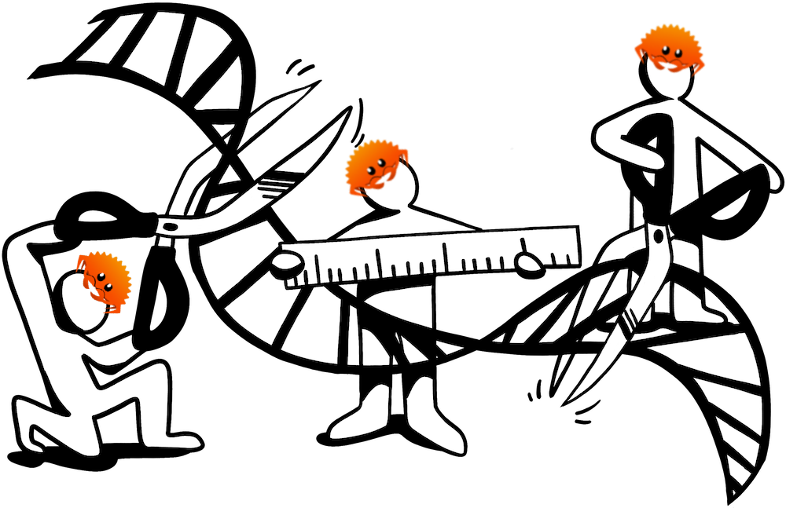

# STRkit Rust extension

Extension for [STRKit](https://github.com/davidlougheed/strkit) 
with components written in Rust, for improved performance.

&copy; the contributors of the STRkit Rust extension 2023. Licensed under
the terms of the [GNU General Public License, v3.0](./LICENSE).




## Testing locally

```bash
pip install maturin pytest
maturin develop
pytest
```
